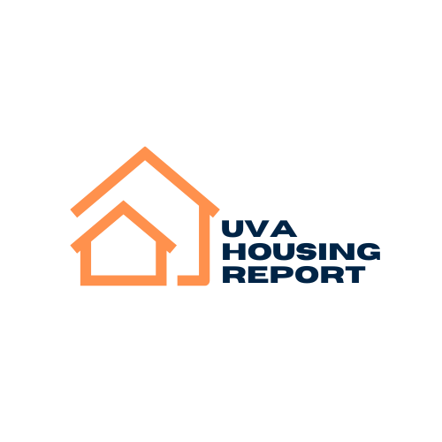

# UVA Housing Report

## Overview
The UVA Housing Report is a comprehensive platform designed for the University of Virginia community to engage in discussions about housing issues, post topics, and submit housing-related complaints, either anonymously or as registered users. The application leverages modern web technologies to ensure a seamless and interactive user experience.

## Features
* **Google OAuth** Integration: Secure login through Google accounts, allowing users to authenticate with their existing Google credentials.
* **Community Forum**: Users can participate in discussions, post new topics about housing, and respond to posts from other users.
* **Complaint Submission**: Users can submit complaints anonymously or through their registered accounts. Registered users can track updates and receive notifications via email.
* **Admin Dashboard**: Site administrators have the capability to review and manage user-submitted complaints and monitor forum activities.
* **Cloud Infrastructure**:
    * Database System: Utilizes PostgreSQL for robust data management.
    * Web Framework: Built on Django 5, offering a powerful backend system designed for rapid development and clean, pragmatic design.
    * Cloud Hosting: Hosted on Heroku, ensuring high availability and scalability.
    * Cloud Storage: Integration with Amazon S3 for efficient file storage and retrieval.
    * Build Environment: Continuous integration and deployment via GitHub Actions CI, ensuring that updates are smoothly rolled out and maintained.

## Demo


## Current Status
At the moment, this web application is not deployed on heroku due to hosting costs, but can be deployed locally with the instructions below. 

## Development Setup

### Prerequisites
* Python 3.10 or higher
* PostgreSQL
* Heroku CLI
* AWS CLI

## Setting Up the Development Environment
1. Clone the repository:

```bash
git clone https://github.com/your-username/uva-housing-report.git
cd uva-housing-report
```

2. Install dependencies:

```bash
pip install -r requirements.txt
```

3. Environment Variables:
Create a .env file in the root directory and populate it with the necessary environment variables:

4. Database Setup:
Run migrations to set up your database schema:

```bash
python manage.py migrate
```

5. Run the development server:

```bash
python manage.py runserver
```


